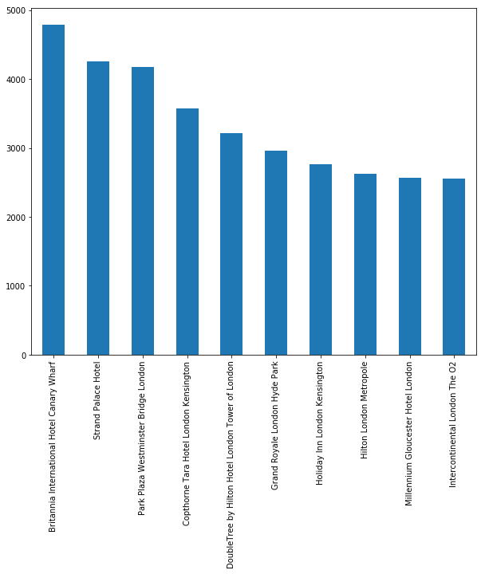
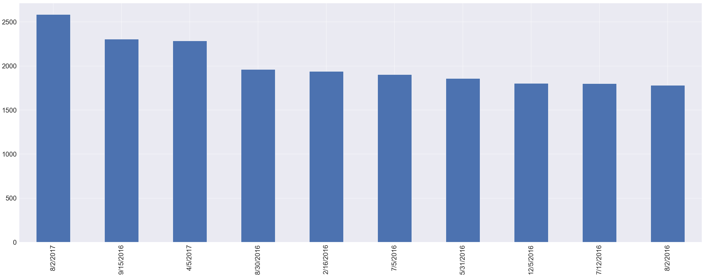
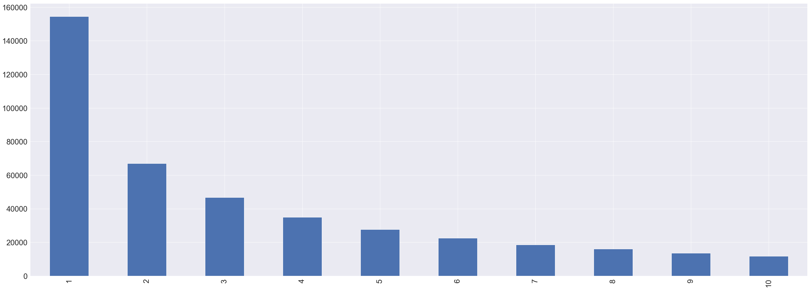

### 4. Exploratory Data Analysis


```python
%matplotlib inline
import pandas as pd
import numpy as np
from matplotlib import pyplot as plt
import math

import seaborn as sns

import warnings
warnings.filterwarnings('ignore')

import missingno as msno
```


```python
#Load data dari file pickle Clean_Data
data = pd.read_pickle('Clean_Data')
```

#### 4.1 Hotel_Name


```python
data.Hotel_Name.describe()
```


    count                                         515212
    unique                                          1492
    top       Britannia International Hotel Canary Wharf
    freq                                            4789
    Name: Hotel_Name, dtype: object


Terdapat __1492__ hotel dan yang paling banyak mendapat reviews adalah hotel __Britannia International Hotel Canary Wharf__ dengan total reviews sebanyak __4789__


```python
#Mengidentifikasi 10 teratas hotel dengan reviews terbanyak
Hotel_Name_count = data.Hotel_Name.value_counts()
Hotel_Name_count[:10].plot(kind='bar',figsize=(10,8))
```


    <matplotlib.axes._subplots.AxesSubplot at 0x21aac2bc898>





#### 4.2 Average_Score


```python
from matplotlib.pylab import rcParams
rcParams['figure.figsize'] = 50, 18
rcParams["axes.labelsize"] = 16
```


```python
avg_plot = data[["Hotel_Name","Average_Score"]].drop_duplicates()
sns.set(font_scale = 2.5)
a4_dims = (30, 12)
fig, ax = plt.subplots(figsize=a4_dims)
sns.countplot(ax = ax,x = "Average_Score",data=avg_plot)
```


    <matplotlib.axes._subplots.AxesSubplot at 0x21aa74af908>


__Average_Score__ hotel berada pada kisaran __8.0 - 9.1__

#### 4.3 Reviewer_Nationality


```python
text = ""
for i in range(data.shape[0]):
    text = " ".join([text,data["Reviewer_Nationality"].values[i]])
```


```python
from wordcloud import WordCloud
wordcloud = WordCloud(background_color='white', width = 600,\
                      height=200, max_font_size=50, max_words=40).generate(text)
wordcloud.recolor(random_state=312)
plt.imshow(wordcloud)
plt.title("Wordcloud for countries ")
plt.axis("off")
plt.show()
```


```python
data.Reviewer_Nationality.describe()
```


    count               515212
    unique                 227
    top        United Kingdom 
    freq                245110
    Name: Reviewer_Nationality, dtype: object


Terdapat __227 Kewarganegaraan yang berbeda__. 
__United Kingdom__ menjadi __negara terbanyak__ yang memberikan review dengan __frekuensi reviews sebesar 245.110__ (__47.57%__ dari total reviews)


```python
#Mengidentifikasi 10 Teratas Kewarganegaraan yang Terbanyak Memberikan Reviews
Reviewer_Nat_Count = data.Reviewer_Nationality.value_counts()
print(Reviewer_Nat_Count[:10])
```

     United Kingdom               245110
     United States of America      35349
     Australia                     21648
     Ireland                       14814
     United Arab Emirates          10229
     Saudi Arabia                   8940
     Netherlands                    8757
     Switzerland                    8669
     Germany                        7929
     Canada                         7883
    Name: Reviewer_Nationality, dtype: int64
    

#### 4.4 Review_Date


```python
data.Review_Date.describe()
```


    count       515212
    unique         731
    top       8/2/2017
    freq          2584
    Name: Review_Date, dtype: object


Terdapat 731 tanggal review yang berbeda.
__Mayoritas reviewers memberikan review pada tanggal 8/2/2017__ dengan __frekuensi reviews__ sebesar __2584__.


```python
#Mengidentifikasi 10 Tanggal Teratas Reviews Terbanyak
Review_Date_count = data.Review_Date.value_counts()
Review_Date_count[:10].plot(kind='bar')
```


    <matplotlib.axes._subplots.AxesSubplot at 0x21ab8f449b0>





#### 4.5 Total_Number_of_Reviews_Reviewer_Has_Given


```python
Reviewers_freq = data.Total_Number_of_Reviews_Reviewer_Has_Given.value_counts()
Reviewers_freq[:10].plot(kind='bar')
```


    <matplotlib.axes._subplots.AxesSubplot at 0x21ab50f19b0>





```python
Reviewers_freq[:10]
```


    1     154506
    2      67011
    3      46802
    4      34991
    5      27604
    6      22593
    7      18599
    8      16126
    9      13526
    10     11702
    Name: Total_Number_of_Reviews_Reviewer_Has_Given, dtype: int64


Sebanyak __154506 (29.99% dari total reviews) reviewers baru pertama kali memberikan review__

#### 4.6 Review_Total_Positive_Word_Counts


```python
pos_words = data.Review_Total_Positive_Word_Counts.value_counts()
pos_words[:10]
```


    0     35904
    6     26887
    5     26809
    4     24624
    7     24517
    8     23219
    3     22505
    9     21188
    2     20905
    10    19597
    Name: Review_Total_Positive_Word_Counts, dtype: int64


```python
a = data.loc[data.Review_Total_Positive_Word_Counts == 0]
print('Number of completely Negative reviews in the dataset:',len(a))
b = a[['Positive_Review','Negative_Review']]
b[:10]
```

    Number of completely Negative reviews in the dataset: 35904
    


<div>
<style scoped>
    .dataframe tbody tr th:only-of-type {
        vertical-align: middle;
    }

    .dataframe tbody tr th {
        vertical-align: top;
    }

    .dataframe thead th {
        text-align: right;
    }
</style>
<table border="1" class="dataframe">
  <thead>
    <tr style="text-align: right;">
      <th></th>
      <th>Positive_Review</th>
      <th>Negative_Review</th>
    </tr>
  </thead>
  <tbody>
    <tr>
      <th>8</th>
      <td>No Positive</td>
      <td>Even though the pictures show very clean room...</td>
    </tr>
    <tr>
      <th>32</th>
      <td>No Positive</td>
      <td>Our bathroom had an urine order Shower was ve...</td>
    </tr>
    <tr>
      <th>98</th>
      <td>No Positive</td>
      <td>Got charged 50 for a birthday package when it...</td>
    </tr>
    <tr>
      <th>121</th>
      <td>No Positive</td>
      <td>The first room had steep steps to a loft bed ...</td>
    </tr>
    <tr>
      <th>134</th>
      <td>No Positive</td>
      <td>Foyer was a mess Only place to relax was the ...</td>
    </tr>
    <tr>
      <th>146</th>
      <td>No Positive</td>
      <td>We booked a 3 night stay in a suite On arriva...</td>
    </tr>
    <tr>
      <th>169</th>
      <td>No Positive</td>
      <td>Nothing One Of The Receptionist she did a rac...</td>
    </tr>
    <tr>
      <th>172</th>
      <td>No Positive</td>
      <td>Hotel under sonstruction which we weren t awa...</td>
    </tr>
    <tr>
      <th>202</th>
      <td>No Positive</td>
      <td>Renovation around the hotel sometimes can sta...</td>
    </tr>
    <tr>
      <th>209</th>
      <td>No Positive</td>
      <td>Not given the room type we had booked and pre...</td>
    </tr>
  </tbody>
</table>
</div>


__Sebanyak 35904 reviews adalah murni negatif__

#### 4.7 Review_Total_Negative_Word_Counts


```python
neg_words = data.Review_Total_Negative_Word_Counts.value_counts()
neg_words[:10]
```


    0     127757
    2      24631
    3      18126
    6      17726
    5      16788
    7      16123
    4      15049
    8      14709
    9      13623
    10     12409
    Name: Review_Total_Negative_Word_Counts, dtype: int64


```python
a = data.loc[data.Review_Total_Negative_Word_Counts == 0 ]
print('No of completely positive reviews in the dataset:',len(a))
b = a[['Positive_Review','Negative_Review']]
b[:10]
```

    No of completely positive reviews in the dataset: 127757
    


<div>
<style scoped>
    .dataframe tbody tr th:only-of-type {
        vertical-align: middle;
    }

    .dataframe tbody tr th {
        vertical-align: top;
    }

    .dataframe thead th {
        text-align: right;
    }
</style>
<table border="1" class="dataframe">
  <thead>
    <tr style="text-align: right;">
      <th></th>
      <th>Positive_Review</th>
      <th>Negative_Review</th>
    </tr>
  </thead>
  <tbody>
    <tr>
      <th>1</th>
      <td>No real complaints the hotel was great great ...</td>
      <td>No Negative</td>
    </tr>
    <tr>
      <th>13</th>
      <td>This hotel is being renovated with great care...</td>
      <td>No Negative</td>
    </tr>
    <tr>
      <th>15</th>
      <td>This hotel is awesome I took it sincirely bec...</td>
      <td>No Negative</td>
    </tr>
    <tr>
      <th>18</th>
      <td>Public areas are lovely and the room was nice...</td>
      <td>No Negative</td>
    </tr>
    <tr>
      <th>48</th>
      <td>The quality of the hotel was brilliant and ev...</td>
      <td>No Negative</td>
    </tr>
    <tr>
      <th>53</th>
      <td>Beautiful setting in a lovely park room very ...</td>
      <td>No Negative</td>
    </tr>
    <tr>
      <th>55</th>
      <td>The hotel is lovely and the staff were amazin...</td>
      <td>No Negative</td>
    </tr>
    <tr>
      <th>59</th>
      <td>Basically everything The style of the hotel i...</td>
      <td>No Negative</td>
    </tr>
    <tr>
      <th>75</th>
      <td>The whole hotel was very clean the staff were...</td>
      <td>No Negative</td>
    </tr>
    <tr>
      <th>78</th>
      <td>Hotel was really nice staff were very friendl...</td>
      <td>No Negative</td>
    </tr>
  </tbody>
</table>
</div>


__Sebanyak 127757 reviews adalah murni negatif__
