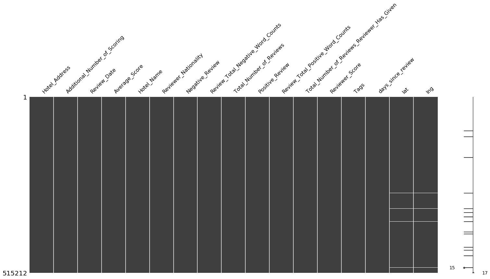
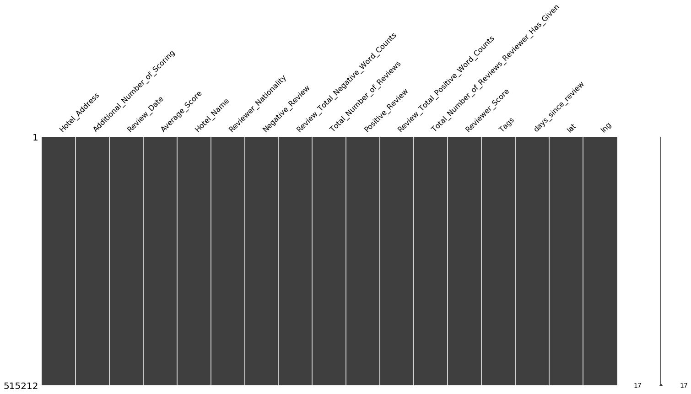
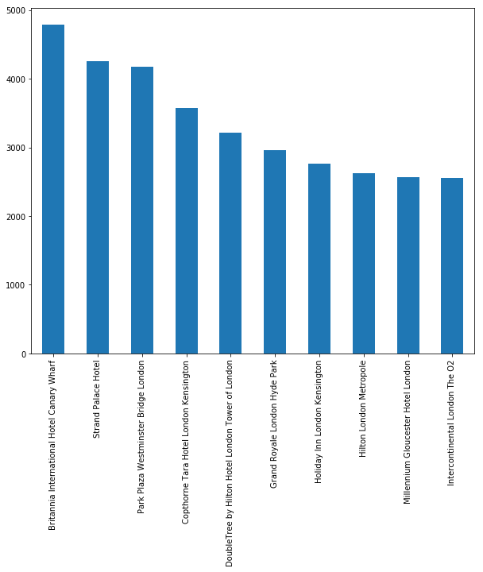
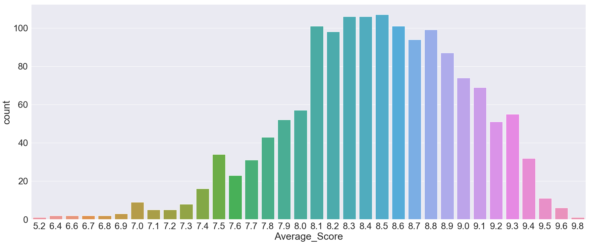
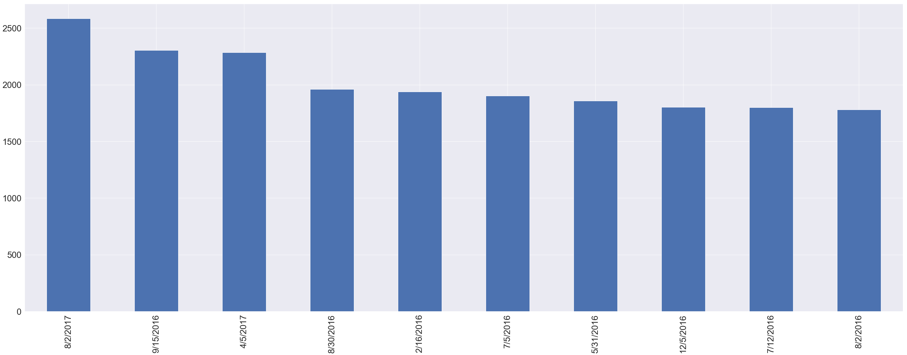
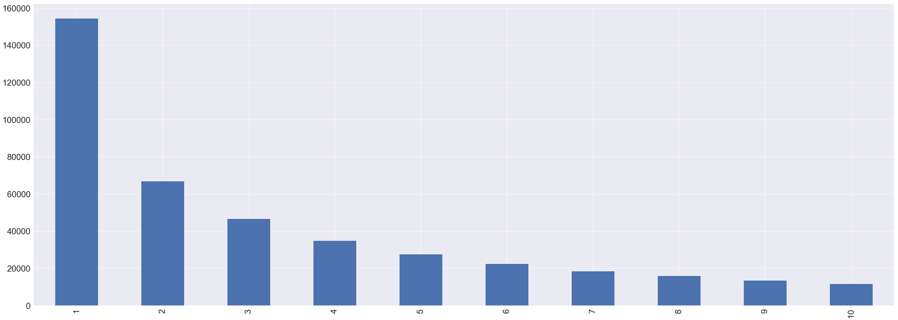

# Rekomendasi Hotel Terbaik di Eropa

### Data Source

Data yang digunakan bersumber dari situs Booking.com yang diakses melalui kaggle. Semua data dalam file sudah tersedia untuk umum bagi semua orang. __[Unduh]__ (https://www.kaggle.com/jiashenliu/515k-hotel-reviews-data-in-europe)

Dataset ini terdiri dari 515.738 review pelanggan dan score terhadap 1492 hotel mewah di Eropa. 
Terdapat 17 features dari dataset ini, yaitu:
1. Hotel_Address: Address of hotel.
2. Review_Date: Date when reviewer posted the corresponding review.
3. Average_Score: Average Score of the hotel, calculated based on the latest comment in the last year.
4. Hotel_Name: Name of Hotel
5. Reviewer_Nationality: Nationality of Reviewer
6. Negative_Review: Negative Review the reviewer gave to the hotel. If the reviewer does not give the negative review, then it should be: 'No Negative'
7. Review_Total_Negative_Word_Counts: Total number of words in the negative review.
8. Positive_Review: Positive Review the reviewer gave to the hotel. If the reviewer does not give the negative review, then it should be: 'No Positive'
9. Review_Total_Positive_Word_Counts: Total number of words in the positive review.
10. Reviewer_Score: Score the reviewer has given to the hotel, based on his/her experience
11. Total_Number_of_Reviews_Reviewer_Has_Given: Number of Reviews the reviewers has given in the past.
12. Total_Number_of_Reviews: Total number of valid reviews the hotel has.
13. Tags: Tags reviewer gave the hotel.
14. days_since_review: Duration between the review date and scrape date.
15. Additional_Number_of_Scoring: There are also some guests who just made a scoring on the service rather than a review. This  number indicates how many valid scores without review in there.
16. lat: Latitude of the hotel
17. lng: longtitude of the hotel

### 1. Load Data


```python
%matplotlib inline
import pandas as pd
import numpy as np
from matplotlib import pyplot as plt
import math

import seaborn as sns

import warnings
warnings.filterwarnings('ignore')
```


```python
data = pd.read_csv("Hotel_Reviews.csv")
```


```python
data.head()
```


<table border="1" class="dataframe">
  <thead>
    <tr style="text-align: right;">
      <th></th>
      <th>Hotel_Address</th>
      <th>Additional_Number_of_Scoring</th>
      <th>Review_Date</th>
      <th>Average_Score</th>
      <th>Hotel_Name</th>
      <th>Reviewer_Nationality</th>
      <th>Negative_Review</th>
      <th>Review_Total_Negative_Word_Counts</th>
      <th>Total_Number_of_Reviews</th>
      <th>Positive_Review</th>
      <th>Review_Total_Positive_Word_Counts</th>
      <th>Total_Number_of_Reviews_Reviewer_Has_Given</th>
      <th>Reviewer_Score</th>
      <th>Tags</th>
      <th>days_since_review</th>
      <th>lat</th>
      <th>lng</th>
    </tr>
  </thead>
  <tbody>
    <tr>
      <th>0</th>
      <td>s Gravesandestraat 55 Oost 1092 AA Amsterdam ...</td>
      <td>194</td>
      <td>8/3/2017</td>
      <td>7.7</td>
      <td>Hotel Arena</td>
      <td>Russia</td>
      <td>I am so angry that i made this post available...</td>
      <td>397</td>
      <td>1403</td>
      <td>Only the park outside of the hotel was beauti...</td>
      <td>11</td>
      <td>7</td>
      <td>2.9</td>
      <td>[' Leisure trip ', ' Couple ', ' Duplex Double...</td>
      <td>0 days</td>
      <td>52.360576</td>
      <td>4.915968</td>
    </tr>
    <tr>
      <th>1</th>
      <td>s Gravesandestraat 55 Oost 1092 AA Amsterdam ...</td>
      <td>194</td>
      <td>8/3/2017</td>
      <td>7.7</td>
      <td>Hotel Arena</td>
      <td>Ireland</td>
      <td>No Negative</td>
      <td>0</td>
      <td>1403</td>
      <td>No real complaints the hotel was great great ...</td>
      <td>105</td>
      <td>7</td>
      <td>7.5</td>
      <td>[' Leisure trip ', ' Couple ', ' Duplex Double...</td>
      <td>0 days</td>
      <td>52.360576</td>
      <td>4.915968</td>
    </tr>
    <tr>
      <th>2</th>
      <td>s Gravesandestraat 55 Oost 1092 AA Amsterdam ...</td>
      <td>194</td>
      <td>7/31/2017</td>
      <td>7.7</td>
      <td>Hotel Arena</td>
      <td>Australia</td>
      <td>Rooms are nice but for elderly a bit difficul...</td>
      <td>42</td>
      <td>1403</td>
      <td>Location was good and staff were ok It is cut...</td>
      <td>21</td>
      <td>9</td>
      <td>7.1</td>
      <td>[' Leisure trip ', ' Family with young childre...</td>
      <td>3 days</td>
      <td>52.360576</td>
      <td>4.915968</td>
    </tr>
    <tr>
      <th>3</th>
      <td>s Gravesandestraat 55 Oost 1092 AA Amsterdam ...</td>
      <td>194</td>
      <td>7/31/2017</td>
      <td>7.7</td>
      <td>Hotel Arena</td>
      <td>United Kingdom</td>
      <td>My room was dirty and I was afraid to walk ba...</td>
      <td>210</td>
      <td>1403</td>
      <td>Great location in nice surroundings the bar a...</td>
      <td>26</td>
      <td>1</td>
      <td>3.8</td>
      <td>[' Leisure trip ', ' Solo traveler ', ' Duplex...</td>
      <td>3 days</td>
      <td>52.360576</td>
      <td>4.915968</td>
    </tr>
    <tr>
      <th>4</th>
      <td>s Gravesandestraat 55 Oost 1092 AA Amsterdam ...</td>
      <td>194</td>
      <td>7/24/2017</td>
      <td>7.7</td>
      <td>Hotel Arena</td>
      <td>New Zealand</td>
      <td>You When I booked with your company on line y...</td>
      <td>140</td>
      <td>1403</td>
      <td>Amazing location and building Romantic setting</td>
      <td>8</td>
      <td>3</td>
      <td>6.7</td>
      <td>[' Leisure trip ', ' Couple ', ' Suite ', ' St...</td>
      <td>10 days</td>
      <td>52.360576</td>
      <td>4.915968</td>
    </tr>
  </tbody>
</table>
</div>


### 2.  Data Introduction


```python
data.shape
```

(515738, 17)

```python
for i in data.columns:
    print(i)
```

Hotel_Address

Additional_Number_of_Scoring

Review_Date

Average_Score

Hotel_Name

Reviewer_Nationality

Negative_Review

Review_Total_Negative_Word_Counts

Total_Number_of_Reviews

Positive_Review

Review_Total_Positive_Word_Counts

Total_Number_of_Reviews_Reviewer_Has_Given

Reviewer_Score

Tags

days_since_review

lat

lng
    


```python
len(data["Hotel_Name"].unique())
```

1492


### 3. Data Cleaning


```python
#Menghapus duplikasi reviews dari dataset
print(sum(data.duplicated()))
data = data.drop_duplicates()
print('After removing Duplicates: {}'.format(data.shape))
```

526

After removing Duplicates: (515212, 17)
    


```python
#Mencari missing values dalam dataset
import missingno as msno
msno.matrix(data)
```





Terdapat beberapa missing values pada kolom lat (latitude) dan lng (longitude)


```python
nan = lambda data: data[data.isnull().any(axis=1)]
nan_data = nan(data)
nan_data = nan_data[['Hotel_Name','lat','lng']]
print('Number of missing values in the dataset: {}'.format(len(nan_data)))
```

Number of missing values in the dataset: 3268
    


```python
nan_data.Hotel_Name.describe()
```


count                                    3268

unique                                     17

top       Fleming s Selection Hotel Wien City

freq                                      658

Name: Hotel_Name, dtype: object


Ada 3268 NaN (missing values) yang terdapat pada 17 hotel (1,13% dari total hotel) 


```python
#Mencari hotel yang memiliki missing values
nan_data.Hotel_Name.value_counts()
```


Fleming s Selection Hotel Wien City                 658

Hotel City Central                                  563

Hotel Atlanta                                       389

Maison Albar Hotel Paris Op ra Diamond              290

Hotel Daniel Vienna                                 245

Hotel Pension Baron am Schottentor                  223

Austria Trend Hotel Schloss Wilhelminenberg Wien    194

Derag Livinghotel Kaiser Franz Joseph Vienna        147

NH Collection Barcelona Podium                      146

City Hotel Deutschmeister                            93

Hotel Park Villa                                     61

Cordial Theaterhotel Wien                            57

Holiday Inn Paris Montmartre                         55

Roomz Vienna                                         49

Mercure Paris Gare Montparnasse                      37

Renaissance Barcelona Hotel                          33

Hotel Advance                                        28

Name: Hotel_Name, dtype: int64


Mengisi missing values pada kolom lat dan lng pada 17 hotel tersebut melalui informasi pada kolom Hotel_Address.


```python
print('No of reviews in the dataset to that Hotel:')
print('Fleming s Selection Hotel Wien City: {}'.format(len(data.loc[data.Hotel_Name == 'Fleming s Selection Hotel Wien City'])))
print('Hotel City Central: {}'.format(len(data.loc[data.Hotel_Name == 'Hotel City Central'])))
print('Hotel Atlanta: {}'.format(len(data.loc[data.Hotel_Name == 'Hotel Atlanta'])))
print('Maison Albar Hotel Paris Op ra Diamond: {}'.format(len(data.loc[data.Hotel_Name == 'Maison Albar Hotel Paris Op ra Diamond'])))
print('Hotel Daniel Vienna: {}'.format(len(data.loc[data.Hotel_Name == 'Hotel Daniel Vienna'])))
print('Hotel Pension Baron am Schottentor: {}'.format(len(data.loc[data.Hotel_Name == 'Hotel Pension Baron am Schottentor'])))
print('Austria Trend Hotel Schloss Wilhelminenberg Wien: {}'.format(len(data.loc[data.Hotel_Name == 'Austria Trend Hotel Schloss Wilhelminenberg Wien'])))
print('Derag Livinghotel Kaiser Franz Joseph Vienna: {}'.format(len(data.loc[data.Hotel_Name == 'Derag Livinghotel Kaiser Franz Joseph Vienna'])))
print('NH Collection Barcelona Podium: {}'.format(len(data.loc[data.Hotel_Name == 'NH Collection Barcelona Podium'])))
print('City Hotel Deutschmeister: {}'.format(len(data.loc[data.Hotel_Name == 'City Hotel Deutschmeister'])))
print('Hotel Park Villa: {}'.format(len(data.loc[data.Hotel_Name == 'Hotel Park Villa'])))
print('Cordial Theaterhotel Wien: {}'.format(len(data.loc[data.Hotel_Name == 'Cordial Theaterhotel Wien'])))
print('Holiday Inn Paris Montmartre: {}'.format(len(data.loc[data.Hotel_Name == 'Holiday Inn Paris Montmartre'])))
print('Roomz Vienna: {}'.format(len(data.loc[data.Hotel_Name == 'Roomz Vienna'])))
print('Mercure Paris Gare Montparnasse: {}'.format(len(data.loc[data.Hotel_Name == 'Mercure Paris Gare Montparnasse'])))
print('Renaissance Barcelona Hotel: {}'.format(len(data.loc[data.Hotel_Name == 'Renaissance Barcelona Hotel'])))
print('Hotel Advance: {}'.format(len(data.loc[data.Hotel_Name == 'Hotel Advance'])))
```

Number of reviews in the dataset to that Hotel:

Fleming s Selection Hotel Wien City: 658

Hotel City Central: 563

Hotel Atlanta: 389

Maison Albar Hotel Paris Op ra Diamond: 290

Hotel Daniel Vienna: 245

Hotel Pension Baron am Schottentor: 223

Austria Trend Hotel Schloss Wilhelminenberg Wien: 194

Derag Livinghotel Kaiser Franz Joseph Vienna: 147

NH Collection Barcelona Podium: 146

City Hotel Deutschmeister: 93

Hotel Park Villa: 61

Cordial Theaterhotel Wien: 57

Holiday Inn Paris Montmartre: 55

Roomz Vienna: 49

Mercure Paris Gare Montparnasse: 37

Renaissance Barcelona Hotel: 33

Hotel Advance: 28
    

Mengisi missing values pada kolom lat dan lng secara manual. 

Untuk mengisi lat, lng Hotel dapat menggunakan informasi pada situs ini [http://latlong.org/]


```python
#Input manual lat hotel
loc_lat = {'Fleming s Selection Hotel Wien City':48.209270,
       'Hotel City Central':48.2136,
       'Hotel Atlanta':48.210033,
       'Maison Albar Hotel Paris Op ra Diamond':48.875343,
       'Hotel Daniel Vienna':48.1888,
       'Hotel Pension Baron am Schottentor':48.216701,
      'Austria Trend Hotel Schloss Wilhelminenberg Wien':48.2195,
      'Derag Livinghotel Kaiser Franz Joseph Vienna':48.245998,
      'NH Collection Barcelona Podium':41.3916,
      'City Hotel Deutschmeister':48.22088,
      'Hotel Park Villa':48.233577,
      'Cordial Theaterhotel Wien':48.209488,
      'Holiday Inn Paris Montmartre':48.888920,
      'Roomz Vienna':48.186605,
      'Mercure Paris Gare Montparnasse':48.840012,
      'Renaissance Barcelona Hotel':41.392673,
      'Hotel Advance':41.383308}
```


```python
#Input manual lng hotel
loc_lng ={'Fleming s Selection Hotel Wien City':16.353479,
       'Hotel City Central':16.3799,
       'Hotel Atlanta':16.363449,
       'Maison Albar Hotel Paris Op ra Diamond':2.323358,
       'Hotel Daniel Vienna':16.3840,
       'Hotel Pension Baron am Schottentor':16.359819,
      'Austria Trend Hotel Schloss Wilhelminenberg Wien':16.2856,
      'Derag Livinghotel Kaiser Franz Joseph Vienna':16.341080,
      'NH Collection Barcelona Podium':2.1779,
      'City Hotel Deutschmeister':16.36663,
      'Hotel Park Villa':16.345682,
      'Cordial Theaterhotel Wien':16.351585,
      'Holiday Inn Paris Montmartre':2.333087,
      'Roomz Vienna':16.420643,
      'Mercure Paris Gare Montparnasse':2.323595,
      'Renaissance Barcelona Hotel':2.167494,
      'Hotel Advance':2.162828}
```


```python
#Menambahkan lat hotel ke dalam kolom lat
data['lat'] = data['lat'].fillna(data['Hotel_Name'].apply(lambda x: loc_lat.get(x)))
#Menambahkan lng hotel ke dalam kolom lng
data['lng'] = data['lng'].fillna(data['Hotel_Name'].apply(lambda x: loc_lng.get(x)))
```


```python
msno.matrix(data)
```





```python
#Menyimpan data ke dalam file pickle
data.to_pickle('Clean_Data')
```


### 4. Exploratory Data Analysis


```python
%matplotlib inline
import pandas as pd
import numpy as np
from matplotlib import pyplot as plt
import math

import seaborn as sns

import warnings
warnings.filterwarnings('ignore')

import missingno as msno
```


```python
#Load data dari file pickle Clean_Data
data = pd.read_pickle('Clean_Data')
```

#### 4.1 Hotel_Name


```python
data.Hotel_Name.describe()
```


count                                         515212

unique                                          1492

top       Britannia International Hotel Canary Wharf

freq                                            4789

Name: Hotel_Name, dtype: object


Terdapat __1492__ hotel dan yang paling banyak mendapat reviews adalah hotel __Britannia International Hotel Canary Wharf__ dengan total reviews sebanyak __4789__


```python
#Mengidentifikasi 10 teratas hotel dengan reviews terbanyak
Hotel_Name_count = data.Hotel_Name.value_counts()
Hotel_Name_count[:10].plot(kind='bar',figsize=(10,8))
```





#### 4.2 Average_Score


```python
from matplotlib.pylab import rcParams
rcParams['figure.figsize'] = 50, 18
rcParams["axes.labelsize"] = 16
```


```python
avg_plot = data[["Hotel_Name","Average_Score"]].drop_duplicates()
sns.set(font_scale = 2.5)
a4_dims = (30, 12)
fig, ax = plt.subplots(figsize=a4_dims)
sns.countplot(ax = ax,x = "Average_Score",data=avg_plot)
```





__Average_Score__ hotel berada pada kisaran __8.0 - 9.1__

#### 4.3 Reviewer_Nationality


```python
text = ""
for i in range(data.shape[0]):
    text = " ".join([text,data["Reviewer_Nationality"].values[i]])
```


```python
from wordcloud import WordCloud
wordcloud = WordCloud(background_color='white', width = 600,\
                      height=200, max_font_size=50, max_words=40).generate(text)
wordcloud.recolor(random_state=312)
plt.imshow(wordcloud)
plt.title("Wordcloud for countries ")
plt.axis("off")
plt.show()
```


```python
data.Reviewer_Nationality.describe()
```


count               515212

unique                 227

top        United Kingdom 

freq                245110

Name: Reviewer_Nationality, dtype: object


Terdapat __227 Kewarganegaraan yang berbeda__. 
__United Kingdom__ menjadi __negara terbanyak__ yang memberikan review dengan __frekuensi reviews sebesar 245.110__ (__47.57%__ dari total reviews)


```python
#Mengidentifikasi 10 Teratas Kewarganegaraan yang Terbanyak Memberikan Reviews
Reviewer_Nat_Count = data.Reviewer_Nationality.value_counts()
print(Reviewer_Nat_Count[:10])
```

United Kingdom               245110

United States of America      35349

Australia                     21648

Ireland                       14814

United Arab Emirates          10229

Saudi Arabia                   8940

Netherlands                    8757

Switzerland                    8669

Germany                        7929

Canada                         7883

Name: Reviewer_Nationality, dtype: int64
    

#### 4.4 Review_Date


```python
data.Review_Date.describe()
```


count       515212

unique         731

top       8/2/2017

freq          2584

Name: Review_Date, dtype: object


Terdapat 731 tanggal review yang berbeda.
__Mayoritas reviewers memberikan review pada tanggal 8/2/2017__ dengan __frekuensi reviews__ sebesar __2584__.


```python
#Mengidentifikasi 10 Tanggal Teratas Reviews Terbanyak
Review_Date_count = data.Review_Date.value_counts()
Review_Date_count[:10].plot(kind='bar')
```





#### 4.5 Total_Number_of_Reviews_Reviewer_Has_Given


```python
Reviewers_freq = data.Total_Number_of_Reviews_Reviewer_Has_Given.value_counts()
Reviewers_freq[:10].plot(kind='bar')
```





```python
Reviewers_freq[:10]
```


1     154506

2      67011

3      46802

4      34991

5      27604

6      22593

7      18599

8      16126

9      13526

10     11702

Name: Total_Number_of_Reviews_Reviewer_Has_Given, dtype: int64


Sebanyak __154506 (29.99% dari total reviews) reviewers baru pertama kali memberikan review__

#### 4.6 Review_Total_Positive_Word_Counts


```python
pos_words = data.Review_Total_Positive_Word_Counts.value_counts()
pos_words[:10]
```


0     35904

6     26887

5     26809

4     24624

7     24517

8     23219

3     22505

9     21188

2     20905

10    19597

Name: Review_Total_Positive_Word_Counts, dtype: int64


```python
a = data.loc[data.Review_Total_Positive_Word_Counts == 0]
print('Number of completely Negative reviews in the dataset:',len(a))
b = a[['Positive_Review','Negative_Review']]
b[:10]
```

Number of completely Negative reviews in the dataset: 35904
    


<table border="1" class="dataframe">
  <thead>
    <tr style="text-align: right;">
      <th></th>
      <th>Positive_Review</th>
      <th>Negative_Review</th>
    </tr>
  </thead>
  <tbody>
    <tr>
      <th>8</th>
      <td>No Positive</td>
      <td>Even though the pictures show very clean room...</td>
    </tr>
    <tr>
      <th>32</th>
      <td>No Positive</td>
      <td>Our bathroom had an urine order Shower was ve...</td>
    </tr>
    <tr>
      <th>98</th>
      <td>No Positive</td>
      <td>Got charged 50 for a birthday package when it...</td>
    </tr>
    <tr>
      <th>121</th>
      <td>No Positive</td>
      <td>The first room had steep steps to a loft bed ...</td>
    </tr>
    <tr>
      <th>134</th>
      <td>No Positive</td>
      <td>Foyer was a mess Only place to relax was the ...</td>
    </tr>
    <tr>
      <th>146</th>
      <td>No Positive</td>
      <td>We booked a 3 night stay in a suite On arriva...</td>
    </tr>
    <tr>
      <th>169</th>
      <td>No Positive</td>
      <td>Nothing One Of The Receptionist she did a rac...</td>
    </tr>
    <tr>
      <th>172</th>
      <td>No Positive</td>
      <td>Hotel under sonstruction which we weren t awa...</td>
    </tr>
    <tr>
      <th>202</th>
      <td>No Positive</td>
      <td>Renovation around the hotel sometimes can sta...</td>
    </tr>
    <tr>
      <th>209</th>
      <td>No Positive</td>
      <td>Not given the room type we had booked and pre...</td>
    </tr>
  </tbody>
</table>
</div>


__Sebanyak 35904 reviews adalah murni negatif__

#### 4.7 Review_Total_Negative_Word_Counts


```python
neg_words = data.Review_Total_Negative_Word_Counts.value_counts()
neg_words[:10]
```


0     127757

2      24631

3      18126

6      17726

5      16788

7      16123

4      15049

8      14709

9      13623

10     12409

Name: Review_Total_Negative_Word_Counts, dtype: int64


```python
a = data.loc[data.Review_Total_Negative_Word_Counts == 0 ]
print('No of completely positive reviews in the dataset:',len(a))
b = a[['Positive_Review','Negative_Review']]
b[:10]
```

No of completely positive reviews in the dataset: 127757
    


<table border="1" class="dataframe">
  <thead>
    <tr style="text-align: right;">
      <th></th>
      <th>Positive_Review</th>
      <th>Negative_Review</th>
    </tr>
  </thead>
  <tbody>
    <tr>
      <th>1</th>
      <td>No real complaints the hotel was great great ...</td>
      <td>No Negative</td>
    </tr>
    <tr>
      <th>13</th>
      <td>This hotel is being renovated with great care...</td>
      <td>No Negative</td>
    </tr>
    <tr>
      <th>15</th>
      <td>This hotel is awesome I took it sincirely bec...</td>
      <td>No Negative</td>
    </tr>
    <tr>
      <th>18</th>
      <td>Public areas are lovely and the room was nice...</td>
      <td>No Negative</td>
    </tr>
    <tr>
      <th>48</th>
      <td>The quality of the hotel was brilliant and ev...</td>
      <td>No Negative</td>
    </tr>
    <tr>
      <th>53</th>
      <td>Beautiful setting in a lovely park room very ...</td>
      <td>No Negative</td>
    </tr>
    <tr>
      <th>55</th>
      <td>The hotel is lovely and the staff were amazin...</td>
      <td>No Negative</td>
    </tr>
    <tr>
      <th>59</th>
      <td>Basically everything The style of the hotel i...</td>
      <td>No Negative</td>
    </tr>
    <tr>
      <th>75</th>
      <td>The whole hotel was very clean the staff were...</td>
      <td>No Negative</td>
    </tr>
    <tr>
      <th>78</th>
      <td>Hotel was really nice staff were very friendl...</td>
      <td>No Negative</td>
    </tr>
  </tbody>
</table>
</div>


__Sebanyak 127757 reviews adalah murni negatif__


### 5. The Best Hotel Recommendation


```python
%matplotlib inline
import pandas as pd
from pandas import read_csv
from pandas import datetime
import numpy as np
from matplotlib import pyplot as plt
import math

import seaborn as sns

import warnings
warnings.filterwarnings('ignore')

import missingno as msno
```


```python
#Load data dari file pickle Clean_Data
data = pd.read_pickle('Clean_Data')
```

#### 5.1 The Total Number of Positive and Negative Reviews


```python
data["pos_count"] = 1
data["neg_count"] = 1
```


```python
data["pos_count"] = data.apply(lambda x: 0 if x["Positive_Review"] == 'No Positive' else x["pos_count"],axis =1)
```


```python
data["pos_count"].value_counts()
```


1    479308

0     35904

Name: pos_count, dtype: int64


```python
data["neg_count"] = data.apply(lambda x: 0 if x["Negative_Review"] == 'No Negative' else x["neg_count"],axis =1)
```


```python
data["neg_count"].value_counts()
```


1    387455

0    127757

Name: neg_count, dtype: int64


```python
reviews = pd.DataFrame(data.groupby(["Hotel_Name"])["pos_count","neg_count"].sum())
```


```python
reviews["Hotel_Name"] = reviews.index
reviews.index = range(reviews.shape[0])
```


```python
reviews.head()
```


<table border="1" class="dataframe">
  <thead>
    <tr style="text-align: right;">
      <th></th>
      <th>pos_count</th>
      <th>neg_count</th>
      <th>Hotel_Name</th>
    </tr>
  </thead>
  <tbody>
    <tr>
      <th>0</th>
      <td>150</td>
      <td>113</td>
      <td>11 Cadogan Gardens</td>
    </tr>
    <tr>
      <th>1</th>
      <td>136</td>
      <td>123</td>
      <td>1K Hotel</td>
    </tr>
    <tr>
      <th>2</th>
      <td>660</td>
      <td>459</td>
      <td>25hours Hotel beim MuseumsQuartier</td>
    </tr>
    <tr>
      <th>3</th>
      <td>103</td>
      <td>55</td>
      <td>41</td>
    </tr>
    <tr>
      <th>4</th>
      <td>28</td>
      <td>18</td>
      <td>45 Park Lane Dorchester Collection</td>
    </tr>
  </tbody>
</table>
</div>


```python
reviews["total"] = reviews["pos_count"] + reviews["neg_count"]
```


```python
data["count"] = 1
count_review = data.groupby("Hotel_Name",as_index=False)["count"].sum()
```

#### 5.2 Famous Hotels in Europe (based in the number of reviews)


```python
reviews = pd.merge(reviews,count_review,on = "Hotel_Name",how = "left")
```


```python
reviews.head()
```


<table border="1" class="dataframe">
  <thead>
    <tr style="text-align: right;">
      <th></th>
      <th>pos_count</th>
      <th>neg_count</th>
      <th>Hotel_Name</th>
      <th>total</th>
      <th>count</th>
    </tr>
  </thead>
  <tbody>
    <tr>
      <th>0</th>
      <td>150</td>
      <td>113</td>
      <td>11 Cadogan Gardens</td>
      <td>263</td>
      <td>159</td>
    </tr>
    <tr>
      <th>1</th>
      <td>136</td>
      <td>123</td>
      <td>1K Hotel</td>
      <td>259</td>
      <td>148</td>
    </tr>
    <tr>
      <th>2</th>
      <td>660</td>
      <td>459</td>
      <td>25hours Hotel beim MuseumsQuartier</td>
      <td>1119</td>
      <td>689</td>
    </tr>
    <tr>
      <th>3</th>
      <td>103</td>
      <td>55</td>
      <td>41</td>
      <td>158</td>
      <td>103</td>
    </tr>
    <tr>
      <th>4</th>
      <td>28</td>
      <td>18</td>
      <td>45 Park Lane Dorchester Collection</td>
      <td>46</td>
      <td>28</td>
    </tr>
  </tbody>
</table>
</div>


```python
for i in reviews.sort_values(by = "count",ascending=False)["Hotel_Name"].head(10).values:
    print(i)
```

Britannia International Hotel Canary Wharf

Strand Palace Hotel

Park Plaza Westminster Bridge London

Copthorne Tara Hotel London Kensington

DoubleTree by Hilton Hotel London Tower of London

Grand Royale London Hyde Park

Holiday Inn London Kensington

Hilton London Metropole

Millennium Gloucester Hotel London

Intercontinental London The O2
    


```python
reviews["pos_ratio"] = reviews["pos_count"].astype("float")/reviews["total"].astype("float")
```

#### 5.3 The Positive Hotels Among The Famous Hotels (based on the number of positive reviews of the famous hotels)


```python
famous_hotels = reviews.sort_values(by = "count",ascending=False).head(100)
```


```python
pd.set_option('display.max_colwidth', 2000)
popular = famous_hotels["Hotel_Name"].values[:10]
data.loc[data['Hotel_Name'].isin(popular)][["Hotel_Name","Hotel_Address"]].drop_duplicates()
```


<table border="1" class="dataframe">
  <thead>
    <tr style="text-align: right;">
      <th></th>
      <th>Hotel_Name</th>
      <th>Hotel_Address</th>
    </tr>
  </thead>
  <tbody>
    <tr>
      <th>8301</th>
      <td>Grand Royale London Hyde Park</td>
      <td>1 Inverness Terrace Westminster Borough London W2 3JP United Kingdom</td>
    </tr>
    <tr>
      <th>14829</th>
      <td>Intercontinental London The O2</td>
      <td>1 Waterview Drive Greenwich London SE10 0TW United Kingdom</td>
    </tr>
    <tr>
      <th>63942</th>
      <td>Britannia International Hotel Canary Wharf</td>
      <td>163 Marsh Wall Docklands Tower Hamlets London E14 9SJ United Kingdom</td>
    </tr>
    <tr>
      <th>111930</th>
      <td>Hilton London Metropole</td>
      <td>225 Edgware Road Westminster Borough London W2 1JU United Kingdom</td>
    </tr>
    <tr>
      <th>164259</th>
      <td>Strand Palace Hotel</td>
      <td>372 Strand Westminster Borough London WC2R 0JJ United Kingdom</td>
    </tr>
    <tr>
      <th>171770</th>
      <td>Millennium Gloucester Hotel London</td>
      <td>4 18 Harrington Gardens Kensington and Chelsea London SW7 4LH United Kingdom</td>
    </tr>
    <tr>
      <th>236055</th>
      <td>DoubleTree by Hilton Hotel London Tower of London</td>
      <td>7 Pepys Street City of London London EC3N 4AF United Kingdom</td>
    </tr>
    <tr>
      <th>440985</th>
      <td>Copthorne Tara Hotel London Kensington</td>
      <td>Scarsdale Place Kensington Kensington and Chelsea London W8 5SY United Kingdom</td>
    </tr>
    <tr>
      <th>504027</th>
      <td>Park Plaza Westminster Bridge London</td>
      <td>Westminster Bridge Road Lambeth London SE1 7UT United Kingdom</td>
    </tr>
    <tr>
      <th>512645</th>
      <td>Holiday Inn London Kensington</td>
      <td>Wrights Lane Kensington and Chelsea London W8 5SP United Kingdom</td>
    </tr>
  </tbody>
</table>
</div>


```python
for i in famous_hotels.sort_values(by = "pos_ratio",ascending=False)["Hotel_Name"].head(10):
    print(i)
```

Hotel Berna

Club Quarters Hotel Lincoln s Inn Fields

Apex Temple Court Hotel

Apex City Of London Hotel

Hotel Esther a

Urban Lodge Hotel

Hilton London Canary Wharf

The Piccadilly London West End

Shangri La Hotel at The Shard London

The Student Hotel Amsterdam City
    


```python
pos = famous_hotels.sort_values(by = "pos_ratio",ascending=False)["Hotel_Name"].head(10).values
data.loc[data['Hotel_Name'].isin(pos)][["Hotel_Name","Hotel_Address"]].drop_duplicates()
```


<table border="1" class="dataframe">
  <thead>
    <tr style="text-align: right;">
      <th></th>
      <th>Hotel_Name</th>
      <th>Hotel_Address</th>
    </tr>
  </thead>
  <tbody>
    <tr>
      <th>971</th>
      <td>Apex Temple Court Hotel</td>
      <td>1 2 Serjeant s Inn Fleet Street City of London London EC4Y 1LL United Kingdom</td>
    </tr>
    <tr>
      <th>147504</th>
      <td>Shangri La Hotel at The Shard London</td>
      <td>31 St Thomas Street Southwark London SE1 9QU United Kingdom</td>
    </tr>
    <tr>
      <th>223782</th>
      <td>Club Quarters Hotel Lincoln s Inn Fields</td>
      <td>61 Lincoln s Inn Fields Camden London WC2A 3JW United Kingdom</td>
    </tr>
    <tr>
      <th>228012</th>
      <td>The Piccadilly London West End</td>
      <td>65 73 Shaftesbury Avenue Westminster Borough London W1D 6EX United Kingdom</td>
    </tr>
    <tr>
      <th>273892</th>
      <td>Urban Lodge Hotel</td>
      <td>Arlandaweg 10 Westpoort 1043 EW Amsterdam Netherlands</td>
    </tr>
    <tr>
      <th>387956</th>
      <td>Apex City Of London Hotel</td>
      <td>No 1 Seething Lane City of London London EC3N 4AX United Kingdom</td>
    </tr>
    <tr>
      <th>450210</th>
      <td>Hotel Esther a</td>
      <td>Singel 303 309 Amsterdam City Center 1012 WJ Amsterdam Netherlands</td>
    </tr>
    <tr>
      <th>454064</th>
      <td>Hilton London Canary Wharf</td>
      <td>South Quay Marsh Wall Tower Hamlets London E14 9SH United Kingdom</td>
    </tr>
    <tr>
      <th>483570</th>
      <td>Hotel Berna</td>
      <td>Via Napo Torriani 18 Central Station 20124 Milan Italy</td>
    </tr>
    <tr>
      <th>509232</th>
      <td>The Student Hotel Amsterdam City</td>
      <td>Wibautstraat 129 Oost 1091 GL Amsterdam Netherlands</td>
    </tr>
  </tbody>
</table>
</div>


#### 5.4 The Most Consistent Performance Hotels


```python
data.Review_Date = pd.to_datetime(data.Review_Date)
```


```python
temp = data.groupby("Hotel_Name", as_index=False)["Reviewer_Score"].agg([np.mean, np.std]).sort_values("mean",ascending=False)
temp = temp[temp["mean"] > 8.9]
temp.shape
temp.sort_values("std").index[0:20]
```


Index(['H10 Casa Mimosa 4 Sup', 'Hotel Casa Camper',
      'H tel de La Tamise Esprit de France', 'Le Narcisse Blanc Spa',
      'Hotel Eiffel Blomet', '45 Park Lane Dorchester Collection', '41',
      'Hotel Stendhal Place Vend me Paris MGallery by Sofitel',
      'H tel D Aubusson', 'Hotel The Serras', 'Hotel Am Stephansplatz',
      'Lansbury Heritage Hotel', 'Covent Garden Hotel', 'The Soho Hotel',
      'Catalonia Magdalenes', 'H tel Saint Paul Rive Gauche',
      'Milestone Hotel Kensington', 'Ritz Paris', 'H tel Fabric',
      'Le 123 S bastopol Astotel'],
      dtype='object', name='Hotel_Name')


```python
lis = ['H10 Casa Mimosa 4 Sup', 'Hotel Casa Camper',
       'H tel de La Tamise Esprit de France', 'Le Narcisse Blanc Spa',
       'Hotel Eiffel Blomet', '45 Park Lane Dorchester Collection', '41',
       'Hotel Stendhal Place Vend me Paris MGallery by Sofitel',
       'H tel D Aubusson', 'Hotel The Serras', 'Hotel Am Stephansplatz',
       'Lansbury Heritage Hotel', 'Covent Garden Hotel', 'The Soho Hotel',
       'Catalonia Magdalenes', 'H tel Saint Paul Rive Gauche',
       'Milestone Hotel Kensington', 'Ritz Paris', 'H tel Fabric',
       'Le 123 S bastopol Astotel']
data.loc[data['Hotel_Name'].isin(lis)][["Hotel_Name","Hotel_Address","Average_Score"]].drop_duplicates()
```


<table border="1" class="dataframe">
  <thead>
    <tr style="text-align: right;">
      <th></th>
      <th>Hotel_Name</th>
      <th>Hotel_Address</th>
      <th>Average_Score</th>
    </tr>
  </thead>
  <tbody>
    <tr>
      <th>11259</th>
      <td>Milestone Hotel Kensington</td>
      <td>1 Kensington Court Kensington and Chelsea London W8 5DL United Kingdom</td>
      <td>9.5</td>
    </tr>
    <tr>
      <th>20472</th>
      <td>Covent Garden Hotel</td>
      <td>10 Monmouth Street Camden London WC2H 9HB United Kingdom</td>
      <td>9.4</td>
    </tr>
    <tr>
      <th>37337</th>
      <td>Lansbury Heritage Hotel</td>
      <td>117 Poplar High Street Tower Hamlets London E14 0AE United Kingdom</td>
      <td>9.4</td>
    </tr>
    <tr>
      <th>41518</th>
      <td>Le 123 S bastopol Astotel</td>
      <td>123 boulevard S bastopol 2nd arr 75002 Paris France</td>
      <td>9.3</td>
    </tr>
    <tr>
      <th>54717</th>
      <td>Ritz Paris</td>
      <td>15 Place Vend me 1st arr 75001 Paris France</td>
      <td>9.8</td>
    </tr>
    <tr>
      <th>81101</th>
      <td>Le Narcisse Blanc Spa</td>
      <td>19 Boulevard De La Tour Maubourg 7th arr 75007 Paris France</td>
      <td>9.5</td>
    </tr>
    <tr>
      <th>111027</th>
      <td>Hotel Stendhal Place Vend me Paris MGallery by Sofitel</td>
      <td>22 Rue Danielle Casanova 1st arr 75002 Paris France</td>
      <td>8.8</td>
    </tr>
    <tr>
      <th>147195</th>
      <td>H tel Fabric</td>
      <td>31 rue de la Folie M ricourt 11th arr 75011 Paris France</td>
      <td>9.3</td>
    </tr>
    <tr>
      <th>152204</th>
      <td>H tel D Aubusson</td>
      <td>33 Rue Dauphine 6th arr 75006 Paris France</td>
      <td>9.4</td>
    </tr>
    <tr>
      <th>176748</th>
      <td>The Soho Hotel</td>
      <td>4 Richmond Mews Westminster Borough London W1D 3DH United Kingdom</td>
      <td>9.5</td>
    </tr>
    <tr>
      <th>176997</th>
      <td>H tel de La Tamise Esprit de France</td>
      <td>4 rue d Alger 1st arr 75001 Paris France</td>
      <td>9.6</td>
    </tr>
    <tr>
      <th>185602</th>
      <td>41</td>
      <td>41 Buckingham Palace Road Westminster Borough London SW1W 0PS United Kingdom</td>
      <td>9.6</td>
    </tr>
    <tr>
      <th>190062</th>
      <td>H tel Saint Paul Rive Gauche</td>
      <td>43 rue Monsieur le Prince 6th arr 75006 Paris France</td>
      <td>8.9</td>
    </tr>
    <tr>
      <th>191786</th>
      <td>45 Park Lane Dorchester Collection</td>
      <td>45 Park Lane Westminster Borough London W1K 1PN United Kingdom</td>
      <td>9.4</td>
    </tr>
    <tr>
      <th>245310</th>
      <td>Hotel Eiffel Blomet</td>
      <td>78 Rue Blomet 15th arr 75015 Paris France</td>
      <td>9.4</td>
    </tr>
    <tr>
      <th>316447</th>
      <td>Hotel Casa Camper</td>
      <td>Elisabets 11 Ciutat Vella 08001 Barcelona Spain</td>
      <td>9.6</td>
    </tr>
    <tr>
      <th>372994</th>
      <td>Catalonia Magdalenes</td>
      <td>Magdalenes 13 15 Ciutat Vella 08002 Barcelona Spain</td>
      <td>9.4</td>
    </tr>
    <tr>
      <th>398945</th>
      <td>Hotel The Serras</td>
      <td>Passeig de Colom 9 Ciutat Vella 08002 Barcelona Spain</td>
      <td>9.6</td>
    </tr>
    <tr>
      <th>402244</th>
      <td>H10 Casa Mimosa 4 Sup</td>
      <td>Pau Claris 179 Eixample 08037 Barcelona Spain</td>
      <td>9.6</td>
    </tr>
    <tr>
      <th>462731</th>
      <td>Hotel Am Stephansplatz</td>
      <td>Stephansplatz 9 01 Innere Stadt 1010 Vienna Austria</td>
      <td>9.3</td>
    </tr>
  </tbody>
</table>
</div>


